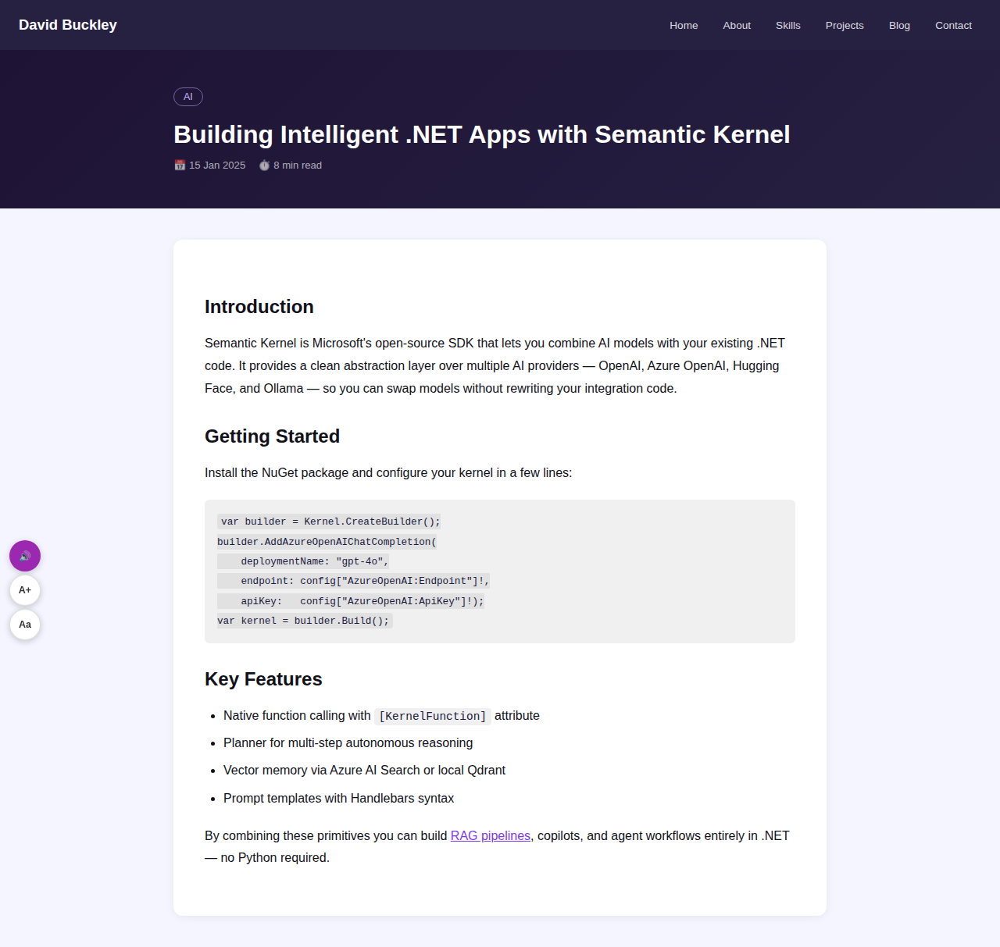
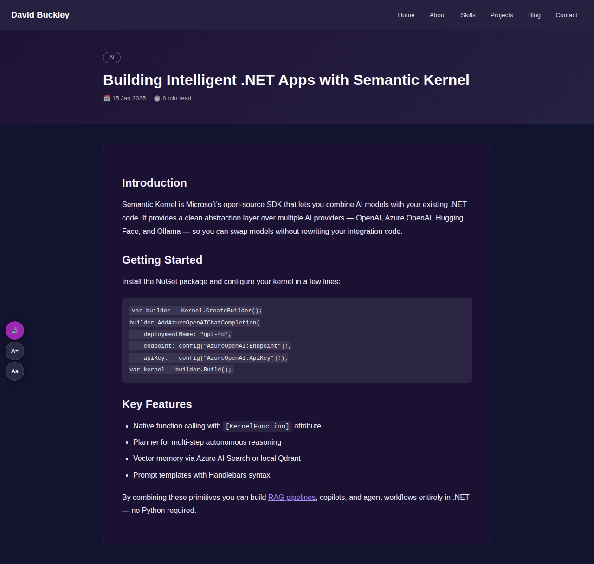
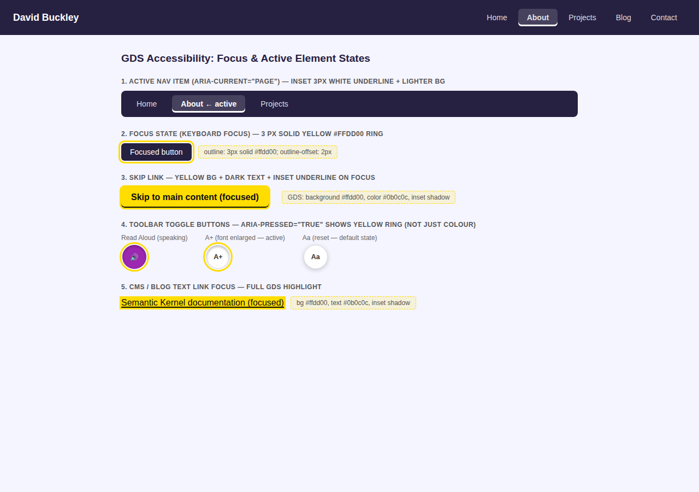

# David Buckley: AI Developer and Security Engineer Portfolio

A professional portfolio website built with .NET 10, Blazor, MudBlazor, and Entity Framework Core. Positions David as a senior software engineer specialising in AI development and application security with 30 years of .NET experience.

## Screenshots

### Home Page


### Projects


### Admin Dashboard: Hero Stats


### Admin Dashboard: Settings (API, Google Analytics, SMS, Mail, Visitor Notifications)


### Admin Dashboard: Blog Posts


### Admin: Media Library (WordPress-style upload and management)

The Media tab provides a thumbnail grid of all uploaded files with upload, copy-URL, open and delete actions.

### Admin: Blog Post Media Gallery — slot-based hero + eBay-style dotted gallery grid

The blog post editor shows a hero image slot (banner, full width) above a responsive grid of dotted secondary slots. Click `+` to add from library or upload; drag to reorder.

### Admin Dashboard: Projects (7 seeded projects, full CRUD)


### Blog listing (paginated, each with a themed featured image)


### Skills (with AI and Security categories)


### About


### Contact (with math CAPTCHA)


### Blog post readability - light mode

Quill saves inline `color` values on every element it writes. The CSS now uses `!important` on `var(--mud-palette-text-primary)` so the theme colour always wins over those inline attributes - giving crisp, readable text in light mode:



### Blog post readability - dark mode

The same theme-aware override keeps text readable on the dark `#1E1335` card background. Code blocks use a separate light-tint background so they remain visually distinct:



### Accessibility toolbar (floating, bottom-left - Read Aloud + font-size controls)

The accessibility toolbar appears on every public page in the bottom-left corner. It provides three buttons:

- **Read Aloud** (voice icon) - starts the Web Speech API reading the page content in document order; changes to a red Stop button while speaking
- **A+** (text-increase icon) - steps font size up: default → 18 px → 20 px
- **Aa** (format-size icon) - resets font size to default

All buttons carry ARIA labels and the toolbar region has `role="toolbar"`. A hidden `aria-live="polite"` region announces each action to screen readers (e.g. "Reading page aloud. Press the stop button to stop.").


### GDS-compliant focus and active-element states

All interactive elements follow UK Government Design System (GDS) accessibility guidelines:

- **Focus ring** - 3 px solid yellow (`#ffdd00`) on every focusable element via `:focus-visible` (keyboard/AT only; not shown on mouse click)
- **Active nav item** - current page button gets `aria-current="page"`, inset 3 px white bottom-bar, and a slightly lighter background so the current location is visible without relying on colour alone
- **Skip link** - GDS yellow background (`#ffdd00`) + dark text (`#0b0c0c`) + inset underline shadow on focus (WCAG 2.4.1)
- **Toggle buttons** - `aria-pressed="true"` on the Read Aloud and font-scale toolbar buttons; a persistent yellow ring makes the pressed/on state visible independently of colour
- **CMS/blog links** - full GDS text-link highlight (yellow background, dark text, dark inset bottom border) on keyboard focus
- **Pressed state** - buttons shift down 1 px on `:active` with a dark inset shadow for tactile feedback



---

## Solution Structure

```
Portfolio.slnx
└── src/
    ├── Portfolio.Shared/              # Shared DTOs and models
    ├── Portfolio.Api/                 # REST Web API (.NET 10) - sole DB owner
    │   ├── Controllers/           # Auth, HeroStats, Projects, Skills, Contact,
    │   │                          #   Blog, CmsPages, MenuItems, AppSettings,
    │   │                          #   MailSettings, SmsSettings, Notifications, Media
    │   ├── Data/                  # ApplicationDbContext + EF Core migrations
    │   ├── Infrastructure/        # DatabaseProviderFactory
    │   └── Models/                # All entity models
    ├── Portfolio.Data.MySql/          # EF Core MySQL provider (Oracle)
    ├── Portfolio.Data.CosmosDb/       # EF Core Azure Cosmos DB provider
    ├── Portfolio.Data.PostgreSql/     # EF Core PostgreSQL provider (Npgsql)
    ├── Portfolio.Sms.Abstractions/    # ISmsService, SmsMessage, SmsResult (no dependencies)
    ├── Portfolio.Sms.ClickSend/       # ClickSend REST API implementation
    ├── Portfolio.Sms.Twilio/          # Twilio REST API implementation
    └── Portfolio.Web/                 # Blazor Web App (server-side, no direct DB access)
        ├── Components/
        │   ├── Layout/            # MainLayout (API-driven nav), NavMenu
        │   ├── Pages/
        │   │   ├── About/         # About page
        │   │   ├── Admin/         # Admin dashboard (Hero Stats, Users, Settings, Blog Posts, Pages, Menus, Projects)
        │   │   ├── Auth/          # Login and AccessDenied pages
        │   │   ├── Blog/          # Blog index + post view (SEO, OG tags, featured images)
        │   │   ├── Contact/       # Contact form with CAPTCHA
        │   │   ├── Error/         # Error and NotFound pages
        │   │   ├── Home/          # Home/landing page
        │   │   ├── Projects/      # Projects listing (Index.razor) + SEO detail pages (Detail.razor at /projects/{slug})
        │   │   ├── Skills/        # Skills page
        │   │   └── CmsPageView.razor  # Catch-all /{**slug} for custom CMS pages
        │   └── Shared/            # RichTextEditor (Quill WYSIWYG wrapper)
        └── Services/              # PortfolioApiService (HttpClient wrapper for all API calls),
                                   #   PortfolioApiAuthService, BlogService, CmsPageService,
                                   #   MenuService, AppSettingsService, EmailSender, SmsSender,
                                   #   StaticSiteGeneratorService
```

## Features

- **AI Developer positioning**: hero section, skills, and projects lead with AI expertise
- **Security focus**: dedicated Security skills category, OWASP/OAuth2/JWT projects
- **Work Project showcase**: dedicated "Work Project" category for BookIt, Curo, and TalentConnect with SVG app-mockup images and tech chip badges
- **WordPress-style CMS**: create, edit, publish and delete blog posts and custom pages entirely from the admin dashboard with no code deploy required
- **WYSIWYG editor**: Quill rich-text editor (served locally, no CDN) for blog posts and pages; supports headings, bold/italic/lists/links/code blocks and more
- **DB-driven navigation**: add, reorder, hide or delete menu items live from the Menus admin tab
- **Custom CMS pages**: publish arbitrary pages at any slug (e.g. `/services`, `/hire-me`) with full SEO metadata
- **SEO and Open Graph**: per-post/page meta title, meta description, OG image and canonical URL injected via `<HeadContent>`
- **Featured images**: optional hero banner image on blog posts and card thumbnail on the blog listing; SVG app mockups on work project posts
- **Tech chip badges**: technology tags displayed as outlined chips on project cards and blog posts - consistent styling across all public pages
- **GitHub & live demo links**: each project card shows GitHub and Live Demo buttons when URLs are set - editable via the admin Projects tab (changes are persisted to Portfolio.Api) with a built-in URL validate button
- **SEO-friendly project detail pages**: every project has an individual page at `/projects/{slug}` with full `<head>` injection (meta description, OG tags, canonical URL); slugs are auto-generated from the project title in the admin form and editable
- **Contact form CAPTCHA**: server-side math challenge blocks spam without any external service or API key
- **Static site generator**: export a complete dark-mode static HTML snapshot of the portfolio as a deployable ZIP from the admin panel
- **Light and dark mode**: respects system preference, toggleable in the header; blog content readable in both modes
- **REST API with fallback**: all public pages (projects, skills, contact) call Portfolio.Api directly; when the API is unreachable the Blazor app uses built-in fallback data so the site remains visible
- **Configurable database provider**: SQL Server, SQLite, PostgreSQL, MySQL, or Azure Cosmos DB via one setting - each backed by a dedicated class library. **Only Portfolio.Api connects to the database**; Portfolio.Web has no direct DB access
- **Centralised Identity**: user accounts live in Portfolio.Api (JWT auth); the Blazor Web app uses cookie auth derived from the API token - no duplicate user tables
- **Swagger UI**: interactive API documentation available at `/swagger` on Portfolio.Api in all environments (including production); JWT auth wired in so you can test protected endpoints directly from the browser
- **Admin area**: create accounts, manage hero stats, configure API/SMS settings, manage blog posts, pages, menus, projects, and generate static exports
- **In-app settings**: API base URL, SMS provider (with all API keys/tokens), Mail (SMTP), and Google Analytics ID configured through the admin Settings tab - all stored in Portfolio.Api's database, no environment variables or app restart needed
- **Paginated blog listing**: public blog page shows 5 posts per page; admin blog table shows 10 rows per page (options: 5 / 10 / 25)
- **Account lockout**: 5 failed attempts triggers a 15-minute lockout
- **Forgot password**: self-service password reset via emailed token (ASP.NET Identity `GeneratePasswordResetTokenAsync` / `ResetPasswordAsync`); link on login page at `/forgot-password`
- **Admin seeded via migration**: the admin user and Admin role are inserted by the `SeedAdminUser` EF Core migration - no environment variables or runtime config required
- **SMS notifications**: contact-form alerts sent to your number via Twilio or ClickSend - all credentials (Account SID, Auth Token, API Key, etc.) stored in DB and managed in Admin → Settings
- **Accessibility (WCAG AA)**: skip-to-content link, landmark roles, floating toolbar with Read Aloud (Web Speech API) and font-size scaling - see [Accessibility](#accessibility) below

## Accessibility

The site is built to WCAG 2.1 AA standards and includes a **floating accessibility toolbar** (bottom-left corner) on every page.

### Accessibility toolbar

| Button | What it does |
|---|---|
| 🔊 **Read Aloud** | Speaks the page content aloud using the browser's built-in Web Speech API (no third-party service required). Reads headings, paragraphs, lists, and table cells in document order with natural pauses. Press again to stop. |
| **A+** (Text Increase) | Increases the base font size: default → large (18 px) → extra-large (20 px). Persisted across page loads via `localStorage`. |
| **Aa** (Text Reset) | Resets font size back to default. |

Each action is announced to screen readers via an `aria-live="polite"` region so assistive technology picks up the state change without interrupting the current reading position.

### Other accessibility features

| Feature | Standard | Detail |
|---|---|---|
| Skip-to-content link | WCAG 2.4.1 | Hidden `<a href="#main-content">` becomes visible on keyboard focus - lets keyboard and screen-reader users jump straight to the page body |
| Landmark regions | WCAG 1.3.1 | `<main id="main-content">` wraps all page body content; `<nav>` via MudDrawer; `role="toolbar"` on the accessibility widget |
| Dark / light theme | WCAG 1.4.3 | Both modes provide sufficient contrast; blog post body text always uses the theme's primary text colour regardless of Quill-saved inline styles |
| Keyboard navigation | WCAG 2.1.1 | All interactive controls reachable by Tab; focus order follows visual reading order |
| ARIA labels | WCAG 4.1.2 | Icon-only buttons (theme toggle, accessibility toolbar) carry descriptive `aria-label` attributes; Read Aloud uses `aria-pressed` to convey toggle state |
| Font scaling | WCAG 1.4.4 | Text scales to 18 px and 20 px without loss of content; selection persisted in `localStorage` |

### Screen reader compatibility

The site has been designed to work with common screen readers:

- **NVDA / JAWS** (Windows) - skip link and landmark structure compatible
- **VoiceOver** (macOS / iOS) - `<main>` landmark and skip link verified
- **TalkBack** (Android) - responsive layout keeps touch targets ≥ 44 × 44 px

The **Read Aloud** feature uses the browser's built-in [Web Speech API](https://developer.mozilla.org/en-US/docs/Web/API/Web_Speech_API) - the same underlying engine used by BrowseAloud-style services - and requires no third-party account or script. Supported in Chrome, Edge, Safari 14+, and Firefox 49+.

## Tech Stack

| Layer | Technology |
|---|---|
| Frontend | ASP.NET Core Blazor (.NET 10) + MudBlazor 8 |
| Backend | ASP.NET Core REST Web API (.NET 10) |
| Database | SQL Server / SQLite / PostgreSQL / MySQL / Cosmos DB + EF Core 9 |
| Auth (Web) | Cookie auth backed by Portfolio.Api JWT (single Identity store) |
| Auth (API) | JWT Bearer tokens |
| AI Skills | Semantic Kernel, Azure OpenAI, RAG, ML.NET |
| Security | OWASP, OAuth2/OIDC, Threat Modelling |
| SMS | Twilio / ClickSend (HTTP, no SDK), provider-agnostic via `ISmsService` |

---

## Prerequisites

- [.NET 10 SDK](https://dotnet.microsoft.com/download/dotnet/10.0)
- One of: SQL Server (LocalDB works), SQLite (zero config), or PostgreSQL

---

## Docker

Both the Web API and the Blazor site have Dockerfiles. A `docker-compose.yml` at the repo root orchestrates both containers together using SQLite for zero-setup persistence.

> **Azure deployment?** See **[DOCKER-AZURE.md](./DOCKER-AZURE.md)** for the full guide to pushing both services to Azure Container Apps or Azure App Service - including ACR setup, environment variable configuration, and switching from SQLite to Azure SQL / PostgreSQL.

### Quick start with Docker Compose

1. **Set the required JWT key** (minimum 32 characters). Copy the example env file and fill in your values:

   ```bash
   cp .env.example .env
   # Edit .env and set JWT_KEY to a strong random string (32+ characters)
   ```

   Or export the variable directly in your shell:

   ```bash
   export JWT_KEY="your-secret-key-minimum-32-characters-long"
   ```

2. **Build and start both containers:**

   ```bash
   docker compose up --build -d
   ```

3. **Access the apps:**
   - Blazor Web App: `http://localhost:5072`
   - REST API: `http://localhost:5008`

4. **Stop the containers:**

   ```bash
   docker compose down
   ```

   Add `-v` to also remove the database volumes: `docker compose down -v`

### Environment variables

The following variables can be set in a `.env` file at the repo root or exported in your shell before running `docker compose up`:

| Variable | Required | Default | Description |
|---|---|---|---|
| `JWT_KEY` | **Yes** | _(none)_ | JWT signing key for Portfolio.Api - minimum 32 characters |
| `ALLOWED_ORIGINS` | No | `http://localhost:5072` | CORS allowed origin for Portfolio.Api |
| `BASE_API_URL` | No | `http://portfolio-api:8080/` | URL Portfolio.Web uses to reach Portfolio.Api |

> **Security:** change `JWT_KEY` before exposing containers publicly. The admin account is seeded via the `SeedAdminUser` migration - no env var needed.

### Building images individually

```bash
# API image only (build context is the src/ directory)
docker build -t portfolio-api -f src/Portfolio.Api/Dockerfile ./src

# Blazor Web image only
docker build -t portfolio-web -f src/Portfolio.Web/Dockerfile ./src
```

### Persistent data

The API container stores its SQLite database in a named Docker volume (`api-data`). Data survives container restarts. Portfolio.Web has no database volume - all state lives in the API.

```bash
# List volumes
docker volume ls

# Copy the API database file out of its volume
docker cp portfolio-api:/app/data/portfolio-api.db ./backup-api.db
```

### Connecting Web to API inside Docker

The default `docker-compose.yml` sets `BaseApiUrl=http://portfolio-api:8080/` so the web container reaches the API over the internal Docker network automatically. No manual configuration is needed after startup.

### Changing the database provider in Docker

The default `docker-compose.yml` uses SQLite for zero-setup persistence. **Only Portfolio.Api uses a database.** To switch to **SQL Server** or **PostgreSQL**, update the environment variables for `portfolio-api` in `docker-compose.yml`.

#### SQL Server

Add a SQL Server service and update both app services:

```yaml
services:
  sqlserver:
    image: mcr.microsoft.com/mssql/server:2022-latest
    environment:
      - ACCEPT_EULA=Y
      - SA_PASSWORD=${SA_PASSWORD}
    ports:
      - "1433:1433"
    volumes:
      - sqlserver-data:/var/opt/mssql

  portfolio-api:
    # ... existing config ...
    environment:
      - DatabaseProvider=SqlServer
      - ConnectionStrings__DefaultConnection=Server=sqlserver,1433;Database=PortfolioApiDb;User Id=sa;Password=${SA_PASSWORD};TrustServerCertificate=True
      # ... other env vars ...
    depends_on:
      - sqlserver

  portfolio-web:
    # ... existing config ...
    # No database configuration needed - Portfolio.Web has no DB
    depends_on:
      - sqlserver

volumes:
  sqlserver-data:
```

Add `SA_PASSWORD` to your `.env` file (must meet SQL Server complexity requirements).

#### PostgreSQL

Add a PostgreSQL service and update the env vars (no code changes needed - the provider library is already referenced):

```yaml
services:
  postgres:
    image: postgres:16
    environment:
      - POSTGRES_USER=portfolio
      - POSTGRES_PASSWORD=${POSTGRES_PASSWORD}
      - POSTGRES_DB=portfolio
    volumes:
      - postgres-data:/var/lib/postgresql/data

  portfolio-api:
    # ... existing config ...
    environment:
      - DatabaseProvider=PostgreSql
      - ConnectionStrings__DefaultConnection=Host=postgres;Database=portfolio_api;Username=portfolio;Password=${POSTGRES_PASSWORD}
      # ... other env vars ...

  portfolio-web:
    # ... existing config ...
    # No database configuration needed - Portfolio.Web has no DB

volumes:
  postgres-data:
```

### Notification (SMS) settings in Docker

The contact form sends an SMS alert to your phone when a visitor submits a message. These settings are **not** environment variables - they are stored in the database and managed entirely through the admin panel. No container restart is needed after changing them.

To configure SMS notifications after the containers are running:

1. Sign in at `http://localhost:5072/login`
2. Go to **Admin → Settings → SMS Provider**
3. Choose a provider (**Twilio** or **ClickSend**), fill in your API credentials, and enter the **Admin receiver number** (E.164 format, e.g. `+447911123456`)
4. Click **Save SMS Settings**
5. Click **Send Test SMS** to verify delivery

See the [SMS Notifications → Admin credentials fields](#admin--settings-sms-provider-fields) table for the full list of fields and where to obtain each value for Twilio and ClickSend.

---

## Build

```bash
git clone <repo-url>
cd portfolio
dotnet build Portfolio.slnx
```

---

## Database Configuration

> **Only Portfolio.Api connects to the database.** Portfolio.Web has no direct database access - it exclusively calls Portfolio.Api over HTTP.

Set `DatabaseProvider` in Portfolio.Api's `appsettings.json` (or override per environment).
All providers are fully supported out of the box - no manual NuGet installs needed.

| Value | Driver | Connection string format |
|---|---|---|
| `SqlServer` (default) | SQL Server / LocalDB | `Server=(localdb)\mssqllocaldb;Database=PortfolioDb;Trusted_Connection=True;` |
| `Sqlite` | SQLite | `Data Source=portfolio.db` |
| `PostgreSql` or `Postgres` | PostgreSQL (Npgsql) | `Host=localhost;Database=portfolio;Username=...;Password=...` |
| `MySql` | MySQL / MariaDB | `Server=localhost;Database=portfolio;User=...;Password=...` |
| `CosmosDb` or `Cosmos` | Azure Cosmos DB | `AccountEndpoint=https://...;AccountKey=...;Database=portfolio` |

Each provider is isolated in its own class library (`Portfolio.Data.MySql`, `Portfolio.Data.CosmosDb`, `Portfolio.Data.PostgreSql`). SQL Server and SQLite are built into `Portfolio.Api` via the standard EF Core packages already referenced.

The database schema is created and all pending migrations are applied automatically at startup via `MigrateAsync()` (SQL Server / PostgreSQL) or `EnsureCreatedAsync()` (SQLite). Seed data (projects, skills, admin user, CMS entities) is inserted on first run when `SeedData: true` is set.

See **[MIGRATIONS.md](./MIGRATIONS.md)** for the full guide on creating, applying, and rolling back migrations for each provider.
See **[eftooling.txt](./eftooling.txt)** for a plain-text quick-reference of every EF Core CLI command.

---

## Running Locally

### Quick start with SQLite (zero setup)

Portfolio.Api's development appsettings already configure SQLite so you can run immediately. Portfolio.Web has no database - it calls the API.

```bash
# Terminal 1: API (owns the database)
cd src/Portfolio.Api
dotnet run

# Terminal 2: Blazor web app (calls the API, no DB needed)
cd src/Portfolio.Web
dotnet run
```

Open `http://localhost:5100` in your browser.

### Using SQL Server

Update `appsettings.Development.json` in **Portfolio.Api only**:

```json
{
  "DatabaseProvider": "SqlServer",
  "ConnectionStrings": {
    "DefaultConnection": "Server=(localdb)\\mssqllocaldb;Database=PortfolioDb;Trusted_Connection=True;"
  }
}
```

---

## Default Login

The admin user and Admin role are seeded directly into the ASP.NET Identity tables via an EF Core migration - no environment variables or runtime config required.

| Field | Value |
|---|---|
| **URL** | `http://localhost:5100/login` (local) or your deployed domain `/login` |
| **Email** | `admin@portfolio.dotnetappdevni.com` |
| **Password** | `Admin@123456!` |

The account is created by the `SeedAdminUser` migration with a fixed password hash. It is available as soon as `dotnet ef database update` runs (or on first startup, which runs migrations automatically).

> **Forgot your password?** Use the **Forgot password?** link on the login page. A reset email will be sent if mail settings are configured in Admin - Settings - Mail.

The admin dashboard is at `/admin` and requires the **Admin** role.

---

## Configuration Reference

### Portfolio.Api: `appsettings.json`

| Key | Description | Example |
|---|---|---|
| `DatabaseProvider` | Database driver | `SqlServer`, `Sqlite`, `PostgreSql`, `MySql`, `CosmosDb` |
| `Jwt:Key` | JWT signing key - **never commit**; inject via env var or secret | _(empty in source - see below)_ |
| `Jwt:Issuer` | JWT issuer claim | `Portfolio.Api` |
| `Jwt:Audience` | JWT audience claim | `Portfolio.Web` |
| `AllowedOrigins` | CORS allowed origins | `https://yourdomain.com` |

> **`Jwt:Key` is intentionally blank in `appsettings.json`.** The app will throw `InvalidOperationException` at startup if the key is missing or empty - it will never silently run without a signing key. See [Secrets Management](#secrets-management) below for how to supply it per environment.

### Portfolio.Web: `appsettings.json`

| Key | Description | Example |
|---|---|---|
| `BaseApiUrl` | Base URL of Portfolio.Api (production default already set) | `https://your-api.azurewebsites.net/` |

> **Portfolio.Web has no database.** It requires only `BaseApiUrl` to locate Portfolio.Api. All data (CMS, blog posts, navigation, settings, etc.) is fetched from the API at runtime. The production value is already set in `appsettings.json`. `appsettings.Development.json` overrides this to `https://localhost:7002/` for local development. You can also override it via an environment variable (`BaseApiUrl=https://...`) or via the admin **Settings** panel (the value saved there takes priority when non-empty).

---

## Secrets Management

Never commit real credentials. Use [.NET User Secrets](https://learn.microsoft.com/en-us/aspnet/core/security/app-secrets) for local development:

```bash
# API secrets (the only project that needs them)
cd src/Portfolio.Api
dotnet user-secrets set "Jwt:Key" "your-secret-key-minimum-32-characters"
```

> The admin account is seeded via the `SeedAdminUser` migration - no user-secrets needed for it.

### Azure App Service

Set the JWT key and other secrets as **Application Settings** in the Azure portal - they are injected as environment variables at runtime. ASP.NET Core maps double-underscore (`__`) to nested config keys:

1. Azure Portal → App Service (`portfolio-api-app`) → **Configuration** → **Application settings**
2. Add the following settings:

| App Setting name | Maps to config key | Value |
|---|---|---|
| `Jwt__Key` | `Jwt:Key` | A strong random string (32+ chars, see below) |

Generate a strong JWT key:
```bash
# Linux / macOS
openssl rand -base64 32

# PowerShell
[Convert]::ToBase64String((1..32 | ForEach-Object { [byte](Get-Random -Max 256) }))
```

3. Click **Save** - the app restarts automatically with the new key injected.

> **Important:** `Jwt:Key` is intentionally blank in committed `appsettings.json`. The Portfolio.Api startup throws `InvalidOperationException` if the key is empty or missing - the app will refuse to start rather than run insecurely.

### Docker Compose

Set `JWT_KEY` in a `.env` file at the repo root (already wired in `docker-compose.yml`):

```bash
cp .env.example .env
# Edit .env and replace the JWT_KEY placeholder with your own key
```

### Production environment variables (general)

```bash
export Jwt__Key="your-production-secret"
```

> The admin account (`admin@portfolio.dotnetappdevni.com` / `Admin@123456!`) is seeded via the `SeedAdminUser` migration and requires no environment variables.

---

## Admin Area

Navigate to `/login` and sign in to access `/admin`. The admin dashboard is organised into nine tabs:

| Tab | What you can do |
|---|---|
| **Hero Stats** | Add, edit or delete the stat cards shown in the hero section |
| **Users** | Create new user accounts and view existing ones |
| **Settings** | Configure the Portfolio API base URL; set up Twilio or ClickSend SMS; set theme colours; configure Blog Post Image Slots (tenant-configurable) |
| **Blog Posts** | Create, edit, publish/unpublish and delete blog posts using the Quill WYSIWYG editor; manage slug, excerpt, tags, read time, featured image, slot-based media gallery (hero image + eBay-style dotted slots) and SEO metadata |
| **Pages** | Create custom CMS pages at any slug (e.g. `/services`); same editor and SEO fields as blog posts |
| **Menus** | Add, edit, reorder, show/hide and delete navigation menu items; changes appear immediately in the nav bar |
| **Projects** | Add, edit and delete portfolio project cards; includes GitHub URL and Live Demo URL fields with a validate button that opens the link in a new tab to verify it works |
| **Media** | WordPress-style media library — upload images and videos (JPEG, PNG, GIF, WebP, SVG, MP4, WebM, OGG, MOV, up to 100 MB); view all uploaded files in a thumbnail grid; copy file URL to clipboard; delete files |
| **Static Site** | Generate a complete dark-mode static HTML snapshot of the portfolio and download it as a deployable ZIP |

There is no public registration page by design.

### Blog Posts: WordPress-style editor

The Blog Posts tab works like WordPress's post editor:

- **List view**: shows all posts with title, slug, category, publish date, status chip (Published / Draft) and quick-action buttons (Edit, Publish/Unpublish, Delete); paginated (10 rows per page, options: 5 / 10 / 25)
- **Status filters**: chip buttons to filter All / Published / Drafts
- **Editor view**: left column: large title field, permalink slug, Quill WYSIWYG body, excerpt; right sidebar: Publish card (status, toggle, date, Save button), Post Settings (category, tags, read time), Featured Image (URL + live preview), **Media Gallery** (slot-based grid with hero image + gallery slots), Source Repository, SEO and Social (meta title, meta description, OG image, canonical URL, expandable panel)
- **Back breadcrumb**: `← Posts` returns to the list without losing context

#### Media Gallery — slot-based image and video grid

The **Media Gallery** card in the blog post editor uses a visual slot-based layout similar to eBay's product image grid:

**Hero Image Slot (Slot 0)**

The first slot is the primary/hero image — displayed prominently at the top of the published post, in listing cards, and as the Open Graph share image. It is shown as a large banner slot in the editor.

**Gallery Slots (Slots 1 – N)**

The remaining slots are displayed as a responsive grid of small dotted rectangles. The total number of slots (default 10) is configurable by the tenant in **Settings → Blog Post Media Slots**.

| Control | Description |
|---|---|
| **+ button** | Click any empty slot to open the media picker and add an image or video |
| **Edit (✏) button** | Click on a filled slot's edit icon to replace the media |
| **Clear (×) button** | Remove the media from a slot without deleting it from the library |
| **Drag handle** | Drag any slot to a new position to reorder media items |
| **Media Picker — URL tab** | Enter a direct URL or choose from your uploaded media library |
| **Media Picker — Upload tab** | Upload a new file directly from your device; it is saved to the media library and inserted into the slot |

> **Migrating old posts:** when you open a post that was saved with the old newline-separated *GalleryImages* format or the previous row-based MediaItems format, all existing items are loaded into the slot grid automatically so nothing is lost.

### Media Library

The **Media** tab provides a WordPress-style media library:

- **Upload**: click **Upload Files** to select one or more images or videos from your device. Files are stored on the API server and served as static files.
- **Supported formats**: images (JPEG, PNG, GIF, WebP, SVG) and videos (MP4, WebM, OGG, MOV), up to 100 MB per file.
- **Thumbnail grid**: all uploaded files are shown as thumbnails (or a video icon for video files).
- **Copy URL**: click the copy icon on any file to copy its public URL to the clipboard for use in posts, pages, or elsewhere.
- **Open in new tab**: preview any file in a new browser tab.
- **Delete**: remove a file from the library and from disk.

Files uploaded via the blog post editor's **Upload** tab are automatically saved to the media library and available for reuse across posts.

### Custom Pages

The Pages tab works identically to Blog Posts but creates stand-alone pages accessible at any custom slug. Published pages are rendered by the catch-all `/{**slug}` route and include full SEO head injection.

### Navigation Menus

The Menus tab lists all current nav items (label, URL, sort order, visibility). Changes, including adding new items or toggling visibility, are reflected live in the navigation bar without a page reload or restart.

### Projects

The Projects tab provides full CRUD management for your portfolio project cards. Each project supports:

- **Title** and **Short Description** (shown on listing cards)
- **Slug** - SEO-friendly URL segment auto-generated from the title when the field loses focus (editable); used as the permalink `/projects/{slug}` for the project detail page
- **Full Description** (shown on the project detail page)
- **Tech Stack** (comma-separated - rendered as chip badges)
- **Category** (e.g. Work Project, Healthcare, AI, Security - drives the card icon and colour)
- **GitHub Repository URL** - text field with a **Validate** button (opens the URL in a new tab so you can confirm the link works before saving)
- **Live Demo URL** - text field with a **Validate** button
- **Image URL** - optional project image
- **Sort Order** and **Featured** toggle (featured projects appear on the home page)

GitHub and Live Demo URLs are displayed as styled buttons on project cards across both the **home page** and the **My Projects** page. Each project card also shows a **Details** button that links to the individual project page at `/projects/{slug}`.

Each project detail page (`/projects/{slug}`) includes:
- Full `<meta>` description and Open Graph tags injected via `<HeadContent>` for search engine and social sharing optimisation
- Canonical URL set to the project's own slug-based URL
- GitHub and Live Demo buttons
- A "More Projects" sidebar with links to other projects

---

## SMS Notifications

Contact-form submissions trigger an SMS alert to the admin receiver number you set in the admin dashboard. **All SMS credentials (API keys, tokens, phone numbers) are stored in the database and managed entirely through Admin → Settings - no config files, environment variables, or app restart required.**

### Admin → Settings: SMS Provider fields

Navigate to `/admin` → **Settings** tab → **SMS Provider** card. All fields are stored encrypted in the database and take effect immediately on Save.

#### Common fields (both providers)

| Field | Description |
|---|---|
| **Enable SMS sending** | Toggle to turn notifications on or off without losing your credentials |
| **Provider** | Select **Twilio**, **ClickSend**, or **None** |
| **Admin receiver number** | Your phone number in E.164 format (e.g. `+447911123456`) - contact-form alerts go here |

#### Twilio credential fields

| Field | Where to find it |
|---|---|
| **Account SID** | [Twilio Console](https://console.twilio.com) dashboard, starts with `AC` |
| **Auth Token** | Twilio Console dashboard (click to reveal) |
| **From number** | A verified Twilio phone number or Messaging Service SID (E.164, e.g. `+14155552671`) |

#### ClickSend credential fields

| Field | Where to find it |
|---|---|
| **Username** | Your ClickSend login email address |
| **API Key** | [ClickSend dashboard](https://dashboard.clicksend.com) → Account → API Credentials → Generate Key |
| **Sender ID** | Optional - up to 11 alphanumeric characters shown as the sender name (e.g. `Portfolio`); leave blank to use your account number |

### Architecture

Three small, focused class libraries handle SMS:

| Library | Role |
|---|---|
| `Portfolio.Sms.Abstractions` | `ISmsService`, `SmsMessage`, `SmsResult` (no external deps) |
| `Portfolio.Sms.Twilio` | Sends via Twilio REST API (Basic Auth, no SDK required) |
| `Portfolio.Sms.ClickSend` | Sends via ClickSend REST API v3 (Basic Auth, no SDK required) |

`SmsSender` (in `Portfolio.Web`) is a thin delegate that calls `POST /api/notifications/test-sms` on Portfolio.Api. The API handles all provider logic, reads credentials from its own database, and dispatches via the correct library.

### Twilio Setup

1. Create a free account at [twilio.com](https://www.twilio.com)
2. From the Console dashboard copy your **Account SID** and **Auth Token**
3. Add a verified phone number as the **From number** (E.164, e.g. `+447911123456`)
4. In Admin → **Settings** → SMS Provider, set **Provider: Twilio**, fill in the credentials, and enter your **Admin receiver number**
5. Click **Save SMS Settings**, then **Send Test SMS** to verify

### ClickSend Setup

1. Create an account at [clicksend.com](https://www.clicksend.com)
2. Go to **Account → API Credentials** and generate an API key
3. Your login email is the **username**
4. In Admin → **Settings** → SMS Provider, set **Provider: ClickSend**, fill in the credentials
5. The **Sender ID** can be up to 11 alphanumeric characters or a phone number
6. Click **Save SMS Settings**, then **Send Test SMS** to verify

### Reusing the SMS libraries in other projects

```csharp
// Static provider (Twilio)
services.AddTwilioSms(o =>
{
    o.AccountSid = "ACxxxxxxxx";
    o.AuthToken  = "your-auth-token";
    o.From       = "+447911000000";
});

// Static provider (ClickSend)
services.AddClickSendSms(o =>
{
    o.Username = "you@example.com";
    o.ApiKey   = "your-api-key";
    o.From     = "Portfolio";
});

// Then inject ISmsService wherever needed
public class MyService(ISmsService sms)
{
    public Task AlertAsync(string phone) =>
        sms.SendAsync(new SmsMessage(phone, "Hello from Portfolio!"));
}
```

---

## Blog & CMS

The blog lives at `/blog`. Posts are stored in the database and managed entirely through the admin **Blog Posts** tab, no code changes or deployments needed.

### Creating a post

1. Go to `/admin` → **Blog Posts** → **Add New Post**
2. Enter a title (the slug is auto-generated but editable)
3. Write the body using the Quill WYSIWYG editor
4. Fill in the excerpt and any post settings (category, tags, read time)
5. Optionally add a featured image URL and SEO/OG metadata in the right sidebar
6. Use the **Media Gallery** card to attach images and videos (see below)
7. Click **Publish** to make it live, or **Save Draft** to keep it hidden

### Post features

- **Slug**: fully editable permalink (e.g. `/blog/my-post-title`)
- **Featured image**: displayed as a full-width hero banner on the post page and as a card thumbnail on the blog listing
- **Media Gallery**: attach images and videos per post in a slot-based visual grid (hero slot + configurable gallery slots); upload directly from device or pick from the media library; reorder with drag-and-drop; add captions
- **SEO**: per-post `<title>`, `<meta name="description">`, `og:title`, `og:description`, `og:image`, and `<link rel="canonical">` injected automatically
- **Status**: toggle between Published and Draft at any time without deleting

### Media Gallery

Every blog post uses a visual **slot-based** media grid:

- **Hero Image (Slot 0)**: the primary/featured image — shown at the top of the post, in listing cards, and as the Open Graph share image. Displayed as a large banner slot in the editor.
- **Gallery Slots (Slots 1–N)**: responsive grid of image/video slots styled like eBay's product image grid with dotted borders. Empty slots show a `+` icon — click to add media.
- **Configurable count**: the total number of slots defaults to 10 and can be changed per tenant in **Settings → Blog Post Media Slots**.

Each slot supports:

| Field | Description |
|---|---|
| **Type** | `Image` — standard responsive photo; `Video` — YouTube/Vimeo URLs become embedded iframes, other URLs use `<video>` |
| **URL** | Direct file URL or YouTube/Vimeo link |
| **Caption** | Optional text shown in `<figcaption>` beneath the item |

YouTube and Vimeo video URLs are detected automatically and converted to responsive 16:9 embedded iframes. Any other video URL is rendered using a native `<video controls>` element.

The **after-article gallery** renders images in a responsive auto-fill grid and videos in a full-width column below the images.

### Seeded posts

The database is seeded with eight posts on first run. Each post has a themed SVG featured image, newspaper-style HTML body with H2 section headings and key terms in bold, and a punchy summary:

- **Building TalentConnect: A Modern Blazor Recruitment Platform**: building a full-stack recruitment platform with job pipelines and analytics (Projects category)
- **Building Curo: A Healthcare Care Management Platform**: Blazor-based care management deployed to Azure with strict compliance (Projects category)
- **Building BookIt: A Blazor Booking Management System**: real-time booking system with SMS notifications and dark/light mode (Projects category)
- **Building AI into .NET Without Losing Your Mind**: production lessons from Semantic Kernel and Azure OpenAI
- **The OWASP Top Ten Is Not a Checklist: It Is a Story**: how to actually use OWASP in .NET
- **What Three Decades of Software Development Taught Me About Writing Code That Lasts**: personal reflection on writing durable code
- **JWT Tokens Are Not Magic and That Matters**: authentication pitfalls in ASP.NET Core
- **Eight Seconds to Eighty Milliseconds: Diagnosing a Production Performance Problem**: tracking down an N+1 query and a missing index to cut API response time from 8 s to 80 ms

### Custom CMS Pages

Create arbitrary pages at any slug from Admin → **Pages**. Published pages are rendered automatically at `/{slug}` and include full SEO metadata. Useful for pages like `/services`, `/hire-me`, `/speaking`, etc.

---

## Static Site Generator

The admin **Static Site** tab generates a complete, deployable, dark-mode HTML snapshot of the entire portfolio in one click.

### What's included in the ZIP

| Content | Details |
|---|---|
| Pages | Home, About, Projects, Skills, Blog (listing + all posts), Contact |
| CMS pages | All published custom pages |
| Stylesheet | Single `css/site.css`, dark mode, brand palette (`#0F0A1E` / `#C4B5FD`) |
| Navigation | Responsive nav with mobile hamburger (pure CSS/JS, no dependencies) |
| Tech chips | Technology badges on project cards and blog posts |
| Images | All project SVGs and featured images bundled at correct relative paths |

### Deployment

| Host | Steps |
|---|---|
| **GitHub Pages** | Extract ZIP into `gh-pages` branch root or a `/docs` folder |
| **Netlify / Vercel** | Drag and drop the extracted folder into the deploy UI |
| **Azure Static Web Apps** | Point the build output to the extracted folder path |

> The static site is a point-in-time snapshot. Re-generate and re-deploy whenever you update content.

---

## Contact Form CAPTCHA

The contact form includes a simple server-side math challenge ("What is A + B?"). The correct answer is required before the message is sent. A wrong answer regenerates the challenge. No external service or API key needed, pure in-component arithmetic.

---

## Work Projects

Three real-world applications are showcased under the **Work Project** category on the Projects and Home pages, each with an SVG app-mockup image, a detailed description, and a matching blog post:

| Project | Description | Tech |
|---|---|---|
| **BookIt** | Full-featured booking management system with real-time availability, SMS notifications, light/dark mode | Blazor, ASP.NET Core, MudBlazor, SQL Server, EF Core |
| **Curo** | Healthcare care management platform for coordinating patient care plans and clinical workflows | ASP.NET Core, Blazor, SQL Server, EF Core, Azure |
| **TalentConnect** | Recruitment management platform with job postings, multi-stage candidate pipelines, and analytics | Blazor, ASP.NET Core, MudBlazor, SQL Server, EF Core |

The full project catalogue also includes:

| Project | Category | Description |
|---|---|---|
| **MAUI Cross-Platform App** | Mobile Application | .NET MAUI app targeting iOS, Android, Windows and macOS from one codebase |
| **Patient CRM** | Healthcare | Patient relationship management system (in development) |
| **AI Diagnostic Assistant** | AI | AI-powered clinical decision support using Semantic Kernel and Azure OpenAI |
| **SecureAPI Framework** | Security | Hardened API security baseline for .NET covering JWT, OWASP mitigations and rate limiting |

---

## Security Notes

- No public registration; admin creates accounts only
- Account lockout after 5 failed login attempts (15-minute lockout)
- Cookie auth for Blazor with 8-hour sliding expiration
- JWT for API with issuer and audience validation
- HTTPS enforced in non-development environments
- HSTS enabled in production
- Sensitive config values are empty in committed `appsettings.json`; supply via secrets or environment variables
- `Jwt:Key` is blank in source - app refuses to start if no key is injected (fail-fast at startup)

---

## Swagger UI (API Documentation)

The Portfolio.Api exposes interactive Swagger documentation via Swashbuckle at `/swagger` in **all environments** (development and production).

| Environment | Swagger URL |
|---|---|
| Local development | `https://localhost:7002/swagger` |
| Azure (production) | `https://<your-api-hostname>/swagger` |
| Docker Compose | `http://localhost:5008/swagger` |

### Using JWT auth in Swagger

1. Call `POST /api/auth/login` with your admin credentials to obtain a JWT token
2. Click **Authorize** (the padlock icon) at the top right of the Swagger UI
3. Enter `Bearer <your-token>` in the Value field
4. Click **Authorize** - all subsequent requests will include the `Authorization` header

### Azure App Service - 500.30 fix

Portfolio.Api is configured with `<AspNetCoreHostingModel>OutOfProcess</AspNetCoreHostingModel>` in `Portfolio.Api.csproj`. This runs the API on the Kestrel web server rather than inside the IIS in-process hosting module, which resolves HTTP 500.30 startup failures on Azure App Service caused by in-process hosting module incompatibilities.

